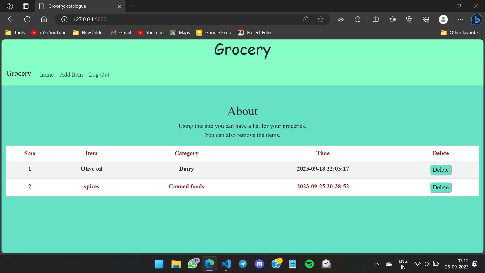

# Grocery list

Hello, Welcome to the Grocery List Web Application! This web application allows users to create and manage their grocery lists with ease. It offers a range of features to help users keep track of their shopping needs.
Watch a demo for this app [here](https://youtu.be/8ix1e4CNbR8?si=28602U5v7dwa86ut)

## Table of Contents
- [Features](#features)
- [Quickstart](#quickstart)
- [Usage](#usage)
- [Contributing](#contributing)
- [License](#license)

# Features

- **Create Lists:** Users can view multiple grocery items which are categorized.
- **Add Items:** Users can add items into the list of grocery.
- **Delete Items:** User can delete item from the list using delete button on the list.

# Quickstart

 1. Register or log into Grocery
 2. Navigate to `add`
 3. Input your details of Grocery.
 4. View your list of items on `index page`
 5. To delete item from your list click on `delete` button.

# Usage

### Register
To get started, create an account by registering with your username and a secure password(as described in criteria for validation). If you're a returning user, simply log in to access your existing lists

All the input fields are must required on this page.

Username should be atleast 5 character.

#### Password Validation
It should contain minimum of 8 character and maximum of 16 character.

It should contain a digit from 0 to 9.

It should contain a Uppercase character ,ie. from A to Z.

It should contain a lowercase character, ie. a to z.

It should also contain atleast one special characters such as "! @ # $ % ^ & * ( ) , . ? " : { } | < > ".

On the confirm password field, user should input exact same input as in password section.

Also the username should not already exist in the database.

### Login page
On the login page user should input a valid username and a password that is specific to user.
Also if an error occur due to invalid input, it redirects to error page.

### Index page
On the index page you can see the list of items in your grocery if you have added otherwise you will see an empty list.It also has a navigation from where you can go to page to add items in your list by clicking on the `add` option.

### Delete button
If you want to remove an item, simply click on the 'Delete' button next to it. Your list is updated instantly, ensuring you always have an accurate representation of your shopping needs.

# Contributing
For any suggestion or contribution feel free to contact and if you would like to contribute on this project, please follow these steps.

1. Fork the repository to your GitHub account.
2. Create a new branch for your feature of bug fix.
3. Commit the changes.
4. Push your branch and create a pull request.

Thanks for checking feel free to contact for any info.

** This was CS50 **